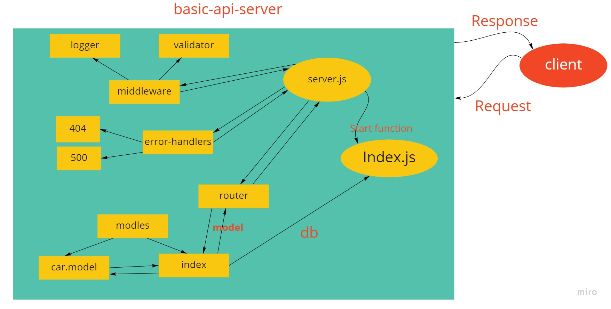

# basic-api-server

- REST API using Express, by creating a proper series of endpoints that perform CRUD operations on a database, using the REST standard,  SQL data model using the Sequelize libary.

---

## How to Build?

1. Create a new repo and go to action then select node.js workflow for CI.

2. Clone it to your local machine and create Package.json and add server.js and index.js.

3. Install the backages.

4. follow the design pattern in the repo and write your own code.

**important note ❗**: You should follow the structure for testing purposes and best practices,

---

## Links

[Main branch deployed on heroku](https://wesam-basic-api-server.herokuapp.com/)

[Pull request from dev branch to main](https://github.com/Wesam-Alqawasmeh/basic-api-server/pull/2)

[GitHub actions](https://github.com/Wesam-Alqawasmeh/basic-api-server/actions)

---

## UML

